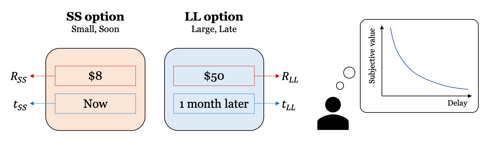

:mod:`adopy.tasks.dd`
======================

.. automodule:: adopy.tasks.dd
   :no-members:

Task
----

.. autoclass:: TaskDD

Model
-----

.. autoclass:: ModelExp
.. autoclass:: ModelHyp
.. autoclass:: ModelHPB
.. autoclass:: ModelCOS
.. autoclass:: ModelQH
.. autoclass:: ModelDE

Engine
------

.. autoclass:: EngineDD
