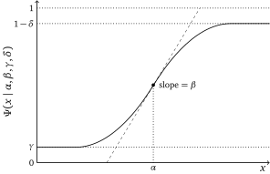

Psychometric Function Estimation
================================

Let’s start with psychometric functions as an example. The goal of the function
is to figure out whether a subject can perceive a signal with varying levels
of magnitude. The function has one design variable for the *intensity* of a
stimulus, :math:`x`; the model has four model parameters:
*guess rate* :math:`\gamma`, *lapse rate* :math:`\delta`,
*threshold* :math:`\alpha`, and *slope* :math:`\beta`.

   A simple diagram for the Psychometric function.

In this example, let’s use the **logistic function** for the model’s shape.
Then, the probability of a subject perceiving the stimulus is:

.. math::

   \Psi(x \mid \alpha, \beta, \gamma, \delta)
   = \gamma + (1 - \gamma - \delta) \; \sigma\big( \beta (x - \alpha) \big)
   \quad \text{where } \sigma(x) = \frac{1}{1 + e^{-x}}

For this example, assume the true parameters are :math:`\gamma = 0.5`,
:math:`\delta = 0.04`, :math:`\alpha = 20`, and :math:`\beta = 1.5`.

.. code:: python

  GR_TRUE = 0.5
  LR_TRUE = 0.04
  TH_TRUE = 20
  SL_TRUE = 1.5

Preparing grids
---------------

ADOpy uses grid-based design optimization. Define one grid for the stimulus
design and one grid for the model parameters. In this example, ``guess_rate``
and ``lapse_rate`` are fixed to single values.

.. code:: python

  import numpy as np

  grid_design = {
      'stimulus': np.linspace(20 * np.log10(.05), 20 * np.log10(400), 120)
  }

  grid_param = {
      'guess_rate': [GR_TRUE],
      'lapse_rate': [LR_TRUE],
      'threshold': np.linspace(20 * np.log10(.1), 20 * np.log10(200), 200),
      'slope': np.linspace(0, 10, 200)
  }

Using pre-defined classes
-------------------------

The :mod:`adopy.tasks.psi` module provides pre-defined classes for 2AFC
psychometric function estimation.

.. code:: python

  from scipy.special import expit
  from scipy.stats import bernoulli

  from adopy.tasks.psi import EnginePsi, ModelLogistic

  model = ModelLogistic()
  engine = EnginePsi(
      model=model,
      grid_design=grid_design,
      grid_param=grid_param,
  )

  design = engine.get_design('optimal')

  p_obs = GR_TRUE + (1 - GR_TRUE - LR_TRUE) * expit(
      SL_TRUE * (design['stimulus'] - TH_TRUE)
  )
  response = {'choice': bernoulli.rvs(p_obs)}

  engine.update(design, response)

``ModelLogistic.compute()`` returns the log likelihood for an observed
``choice`` value. For example:

.. code:: python

  log_lik = model.compute(
      choice=1,
      stimulus=design['stimulus'],
      guess_rate=GR_TRUE,
      lapse_rate=LR_TRUE,
      threshold=TH_TRUE,
      slope=SL_TRUE,
  )

Using self-defined classes
--------------------------

Instead of using pre-defined classes, you can define a task and model directly
with :class:`adopy.Task`, :class:`adopy.Model`, and :class:`adopy.Engine`.

.. code:: python

  from scipy.special import expit
  from scipy.stats import bernoulli

  from adopy import Engine, Model, Task

  task_psi = Task(
      name='Psi',
      designs=['stimulus'],
      responses=['choice'],
  )

  def logistic_loglik(stimulus, guess_rate, lapse_rate,
                      threshold, slope, choice):
      p_obs = guess_rate + (1 - guess_rate - lapse_rate) * expit(
          slope * (stimulus - threshold)
      )
      return bernoulli.logpmf(choice, p_obs)

  model_log = Model(
      name='Logistic',
      task=task_psi,
      params=['guess_rate', 'lapse_rate', 'threshold', 'slope'],
      func=logistic_loglik,
  )

  grid_response = {'choice': [0, 1]}

  engine_psi = Engine(
      task=task_psi,
      model=model_log,
      grid_design=grid_design,
      grid_param=grid_param,
      grid_response=grid_response,
  )

  design = engine_psi.get_design('optimal')
  response = {'choice': 1}
  engine_psi.update(design, response)
