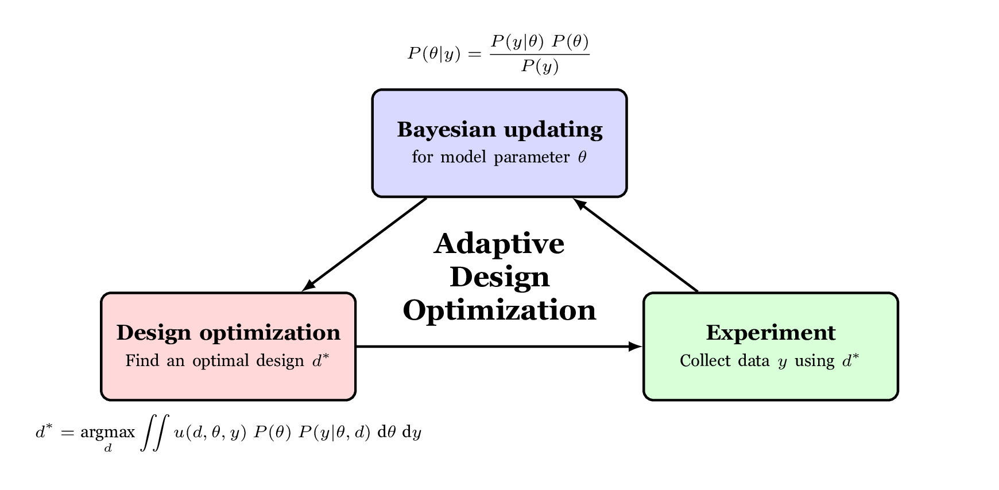

Getting Started
===============

Installation
------------

Using pip, you can install adopy from PyPI.

.. code:: bash

    pip install adopy

Instead, you can install the developmental version in the GitHub repository.

.. code:: bash

    git clone https://github.com/adopy/adopy.git
    cd adopy
    git checkout develop
    pip install .

Quick-start guide
-----------------

Here, we present how to use ADOpy to compute optimal designs for an experiment.
Assuming an arbitrary task and a model, this section shows how users can apply
the Adaptive Design Optimization procedure into their own tasks and models
from the start.

    A simple diagram for the Adaptive Design Optimization.

Step 1. Define a task using :py:class:`adopy.Task`
~~~~~~~~~~~~~~~~~~~~~~~~~~~~~~~~~~~~~~~~~~~~~~~~~~

Assume that a user want to use ADOpy for an *arbitrary* task with two design
variables (``x1`` and ``x2``) where participants can make a binary choice on each
trial. Then, the task can be defined with :py:class:`adopy.Task` as described below:

.. code:: python

    from adopy import Task

    task = Task(name='My New Experiment',  # Name of the task (optional)
                designs = ['x1', 'x2'],    # Labels of design variables
                responses = [0, 1])        # Possible responses

Step 2. Define a model using :py:class:`adopy.Model`
~~~~~~~~~~~~~~~~~~~~~~~~~~~~~~~~~~~~~~~~~~~~~~~~~~~~

To predict partipants' choices, here we assume a logistic regression model
that calculates the probability to make a positive response using three model
parameters (``b0``, ``b1``, and ``b2``):

.. math::

    p = \frac{1}{1 + \exp\left[ - (b_0 + b_1 x_1 + b_2 x_2) \right]}

How to compute the probabilty :math:`p` should be defined as a function:

.. code:: python

    import numpy as np

    def calculate_prob(x1, x2, b0, b1, b2):
        """A function to compute the probability of a positive response."""
        logit = b0 + x1 * b1 + x1 * b2
        p_obs = 1. / (1 + np.exp(-logit))
        return p_obs

Using the information and the function, the model can be defined with
:py:class:`adopy.Model`:

.. code:: python

    from adopy import Model

    model = Model(name='My Logistic Model',   # Name of the model (optional)
                params=['b0', 'b1', 'b2'],  # Labels of model parameters
                func=calculate_prob)        # A probability function

Step 3. Define grids for design variables and model parameters
~~~~~~~~~~~~~~~~~~~~~~~~~~~~~~~~~~~~~~~~~~~~~~~~~~~~~~~~~~~~~~

Since ADOpy uses grid search to search the design space and parameter space,
you must define a grid for design variables and model parameters.
The grid can be defined using the labels (of design variables or model
parameters) as its key and an array of the corresponding grid points
as its value.

.. code:: python

    import numpy as np

    grid_designs = {
        'x1': np.linspace(0, 50, 100),    # 100 grid points within [0, 50]
        'x2': np.linspace(-20, 30, 100),  # 100 grid points within [-20, 30]
    }

    grid_param = {
        'b0': np.linspace(-5, 5, 100),  # 100 grid points within [-5, 5]
        'b1': np.linspace(-5, 5, 100),  # 100 grid points within [-5, 5]
        'b2': np.linspace(-5, 5, 100),  # 100 grid points within [-5, 5]
    }

Step 4. Initialize an engine using :py:class:`adopy.Engine`
~~~~~~~~~~~~~~~~~~~~~~~~~~~~~~~~~~~~~~~~~~~~~~~~~~~~~~~~~~~

Using the objects created so far, an engine should be initialized using
:py:class:`adopy.Engine`. It contains built-in functions to compute an
optimal design using ADO.

.. code:: python

    from adopy import Engine

    engine = Engine(model=model,              # a Model object
                    task=task,                # a Task object
                    grid_design=grid_design,  # a grid for design variables
                    grid_param=grid_param)    # a grid for model parameters

Step 5. Compute a design using the engine
~~~~~~~~~~~~~~~~~~~~~~~~~~~~~~~~~~~~~~~~~

.. code:: python

    # Compute an optimal design based on the ADO
    design = engine.get_design()
    design = engine.get_design('optimal')

    # Compute a randomly chosen design, as is typically done in non-ADO experiments
    design = engine.get_design('random')

Step 6. Collect an observation in your experiment
~~~~~~~~~~~~~~~~~~~~~~~~~~~~~~~~~~~~~~~~~~~~~~~~~

.. code:: python

    # Get a response from a participant using your own code
    response = ...

Step 7. Update the engine with the observation
~~~~~~~~~~~~~~~~~~~~~~~~~~~~~~~~~~~~~~~~~~~~~~

.. code:: python

    # Update the engine with the design and the corresponding response
    engine.update(design, response)

Step 8. Repeat Step 5 through Step 7 until the experiment is over
~~~~~~~~~~~~~~~~~~~~~~~~~~~~~~~~~~~~~~~~~~~~~~~~~~~~~~~~~~~~~~~~~

.. code:: python

    NUM_TRIAL = 100  # number of trials

    for trial in range(NUM_TRIAL):
        # Compute an optimal design for the current trial
        design = engine.get_design('optimal')

        # Get a response using the optimal design
        response = ...  # Using users' own codes

        # Update the engine
        engine.update(design, response)

More examples
-------------

There are `more examples`_ on how to use ADOpy for other experimental tasks.

.. _more examples: https://github.com/adopy/adopy/tree/master/examples
